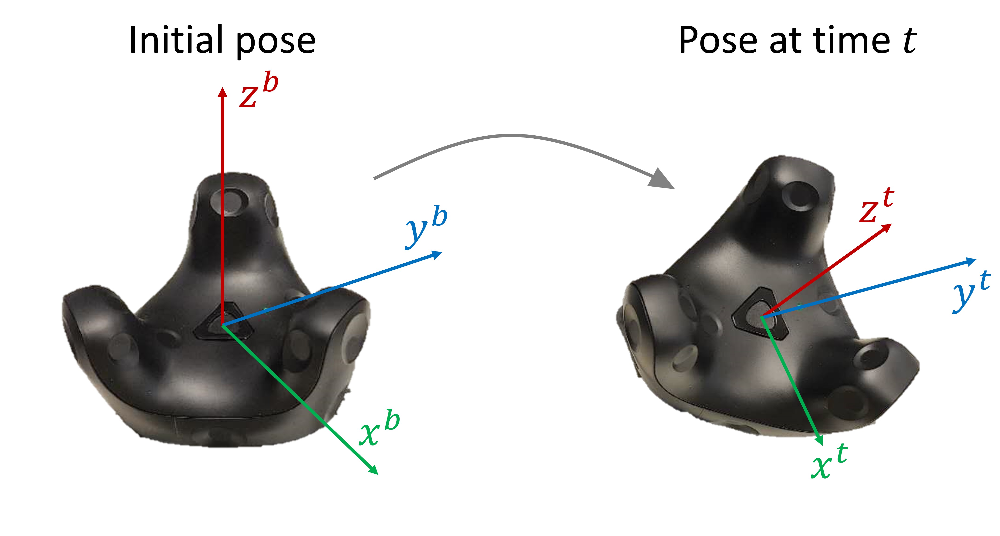

## Description
This package is used to stream the pose of HTC Vive Tracker 3.0 in ROS2. Single (on one hand) or dual (on both hands) trackers can be tracked.
1. Tracker frame: The definition of tracker frame is shown in the figure below. There will be a frame calibration when starting the node and the initial frame of the tracker will be regarded as base frame.


2. Streamed pose: The streamed pose of tracker is the pose w.r.t. the base frame.
3. Output format: The streamed pose is published with ROS2 msg `std_msgs/msg/Float64MultiArray.msg`. Two kinds of orientation representation are possible: orienation matrix and quaternion. Check **Customize arguments** on how to choose the orientation representation. The data in msg is organized as
    - orienation matrix: `[x,y,z,r11,r21,r31,r12,r22,r32,r13,r23,r33]` (matrix reshaped in column-first way).
    - quaternion: `[x,y,z,r11,qw,qx,qy,qz]`.

## Prerequisite
1. Hardwares
- HTC Vive VR base station (at least 1, if using 2 base stations, a synchronizing cable may be needed)
- HTC Vive Headset (don't need to wear it but it needs to be in the view of a base station)
- HTC Vive Tracker 3.0 (1 or 2)
2. Softwares
- ROS2 humble installed on Ubuntu 22.04
- Steam VR
## Get started
1. Create a workspace and a src folder in the workspace (e.g. `mkdir vr_ws && cd vr_ws && mkdir src`). Clone the repo under `src` then go to workspace.
2. Turn on the VR devices and pair the trackers in Steam VR.
3. Get the tracker serial with
```
python3 src/vr_tracking/vr_tracking/get_tracker_serial.py
```
If you are using two trackers, check their serials one by one and decide which one is for left or right hand. Copy the corresponding serial into the config file `/src/vr_tracking/config/config.yaml`. If you are only using one tracker, you only need to copy one serial and leave the other one in the config file unchanged. 

4. Build the package `colcon build` and source it `source install/setup.bash`.
5. Test the units
```
colcon test --packages-select vr_tracking
colcon test-result --verbose
```
If all the tests are passed, you can start the streaming node:
```
ros2 run vr_tracking tracker_pub
```
Notice: Please follow the instruction shown in the terminal and hold the the tracker still before the frame calibration is done! When you see `left/right frame calibrated`, you can move the tracker.
## Customize arguments
The arguments that can be customized are defined in the config file `/src/vr_tracking/config/config.yaml`. There are two ways to configure them.
1. Directly change the arguments in config file.
2. Use argument parser when running the node, e.g.
```
ros2 run vr_tracking tracker_pub --freq 30 --quat True
```
## Credits
The file `vr_tracking/track.py` is forked from [Vive_Tracker](https://github.com/snuvclab/Vive_Tracker).

